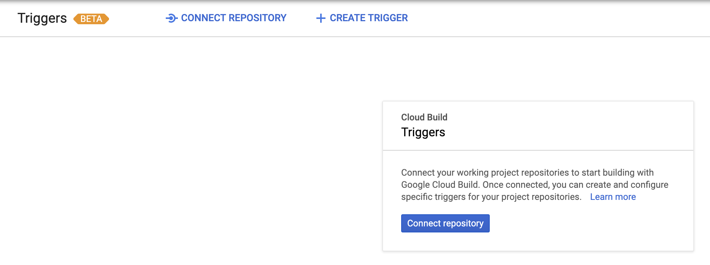
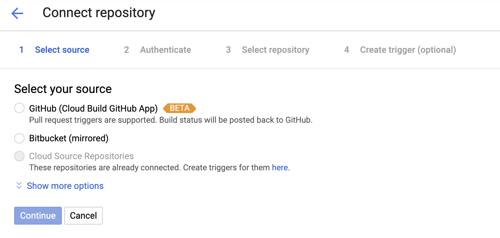
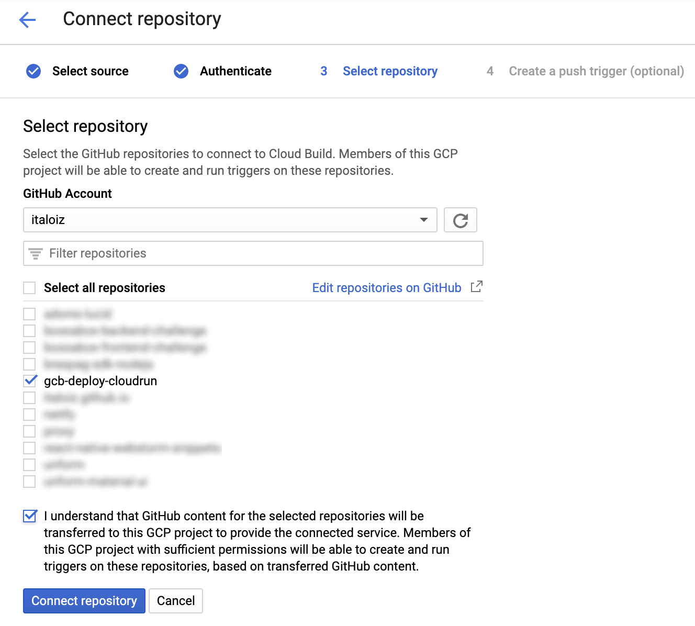
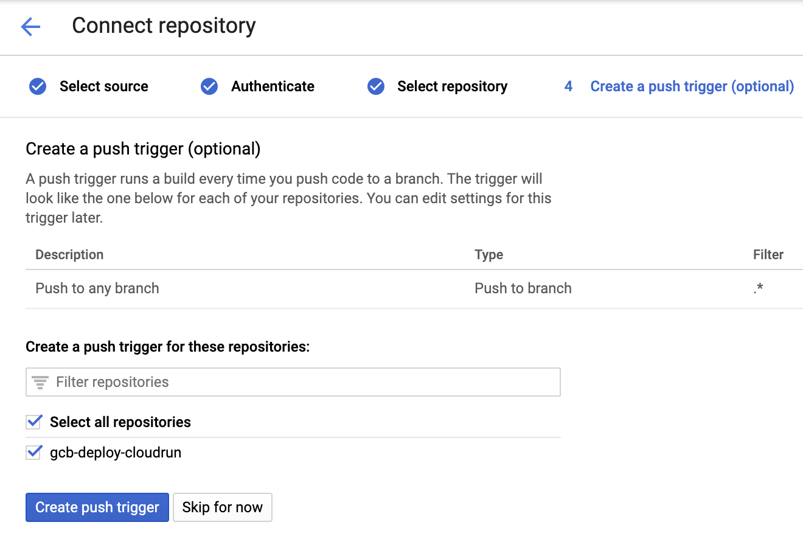
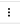
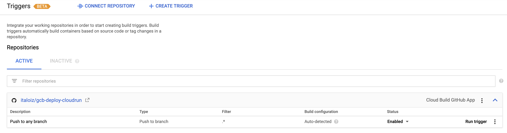
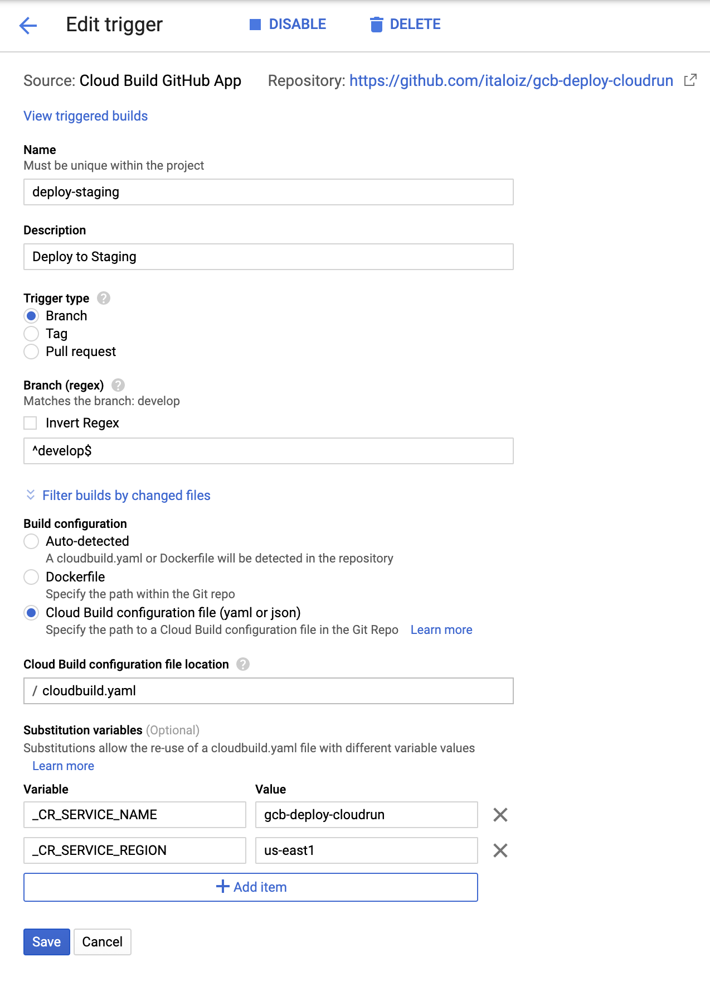
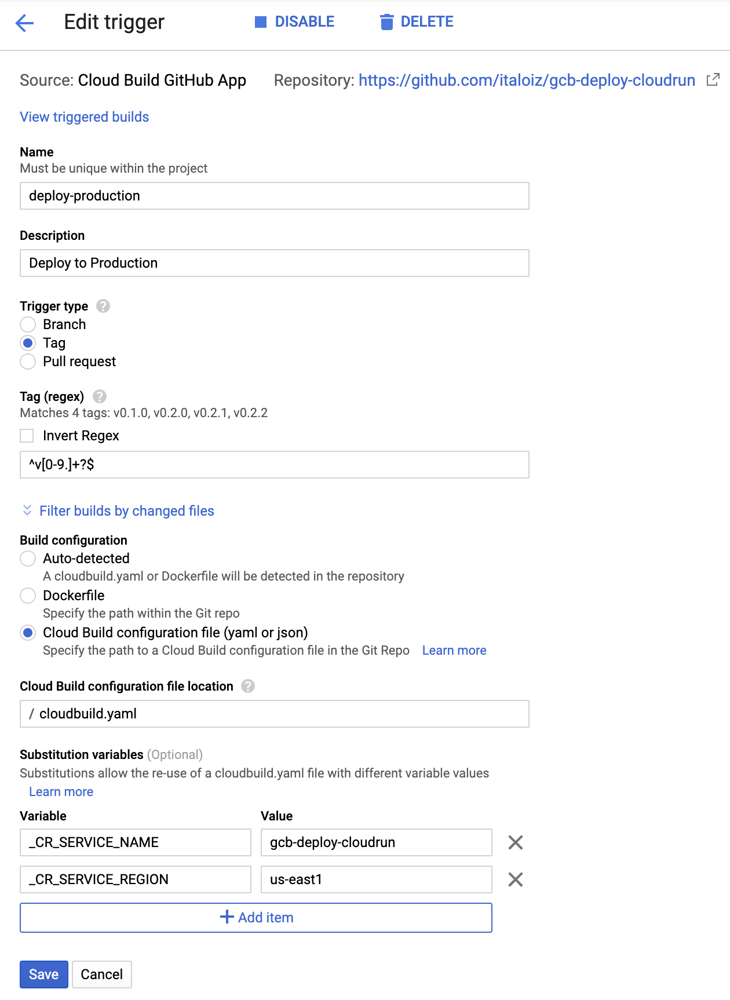

# Deploy to Cloud Run using Google Cloud Build (GCB)

This repository contains information on how to configure [Google Cloud Build](https://cloud.google.com/cloud-build/) to automatically deploy to [Google Cloud Run](https://cloud.google.com/run/) with tagging strategy.

## How it works?

1. We will configure Cloud Build to integrate with repository where your code is (Also called *Triggers*);
2. We will create the configuration file `cloudbuild.yaml` in the project root;
3. Now just send the codes! 🥳

## Let's set up

### 1. Connect Repository

*You will see a screen similar to this, click on "Connect repository".*

### 2. Source Select

*Here we select Github, although it is in beta, it works very well 🙂*

### 3. Select Repository

*When you click continue in the previous step, you may be prompted to give Google Cloud Build access permissions to access your repository. You will then be taken to a screen similar to the one below*

### 4. Create your first Trigger!

*In this step, click "Create push trigger". We will configure soon after.*

### 5. Choosing trigger to configure!

*Click on menu  then click on "Edit"*

### 6. Configuring Trigger! 

*The configuration shown in the image below is made for the staging environment but I am willing to modify it as needed.*

*The variables declared at the end of the image are required and are used in the `cloudbuild.yaml` configuration file to streamline the entire process.*

| Variable           | Description                                                                                |
| :----------------- | :----------------------------------------------------------------------------------------- |
| _CR_SERVICE_NAME   | The name of the service in Cloud Run. If it does not exist, a new service will be created. |
| _CR_SERVICE_REGION | The region in which the service will run.                                                  |

 

### 7. Create the configuration file

*You can copy the [`cloudbuild.yaml`](cloudbuild.yaml) configuration file and paste it into the root of your project, feel free to modify it according to your needs.*

### 8. Configuring Production Trigger!

*Go back to the main screen and click the trigger menu () you just set, and click "Duplicate"*

*The production setup should look like the image below, not a mandatory rule, feel free to modify to suit your needs.*

*The only thing different here is, in "Trigger type" we select as "Tag" and in "Tag (regex)" we put `^v[0-9.]+?$`*.

*So every time we create a tag in `v0.1.0`, `v1.0.0`, `v0.2.0`, `vX.Y.Z` format in our repository, this trigger will be activated.*

### We ended up here! 😊

*Now you can start uploading the code in the `develop` branch of your repository and a Cloud Run service will create a staging tag image, and each time in your repository you create a new tag in `vX.Y.Z` format a Cloud Run service will be created with tag image "latest" and "vX.Y.Z".*

*This is a simple project that we use a `Dockerfile` to create a docker image and upload to the private [Container Registry](https://cloud.google.com/container-registry) on google, but it can be adapted to various situations.*